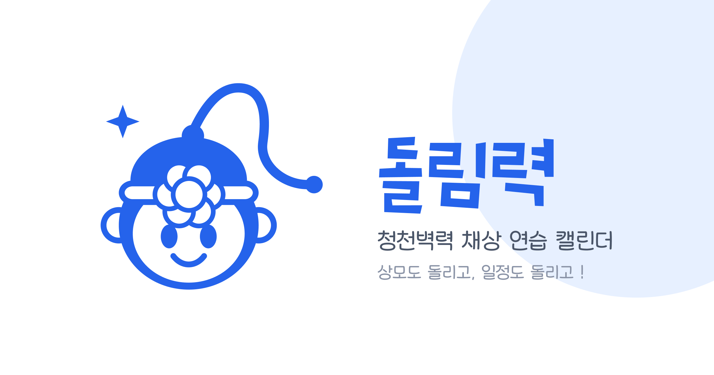
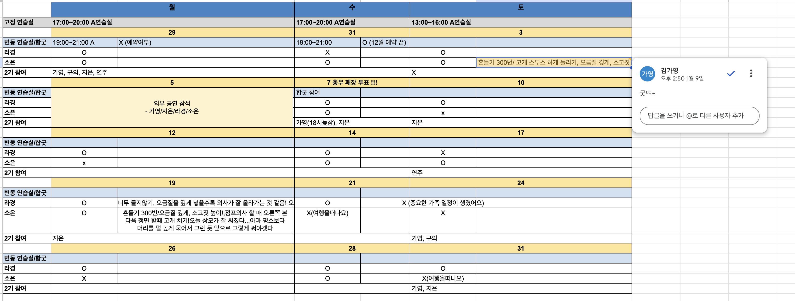
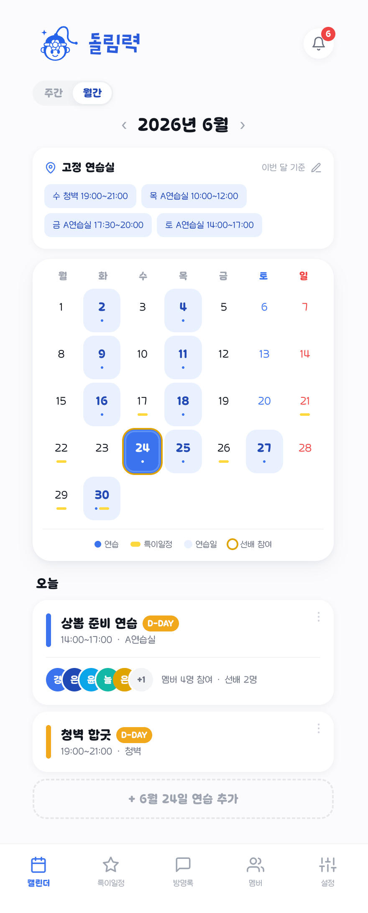
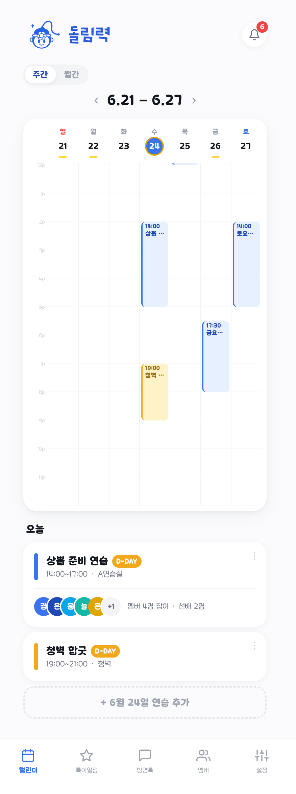
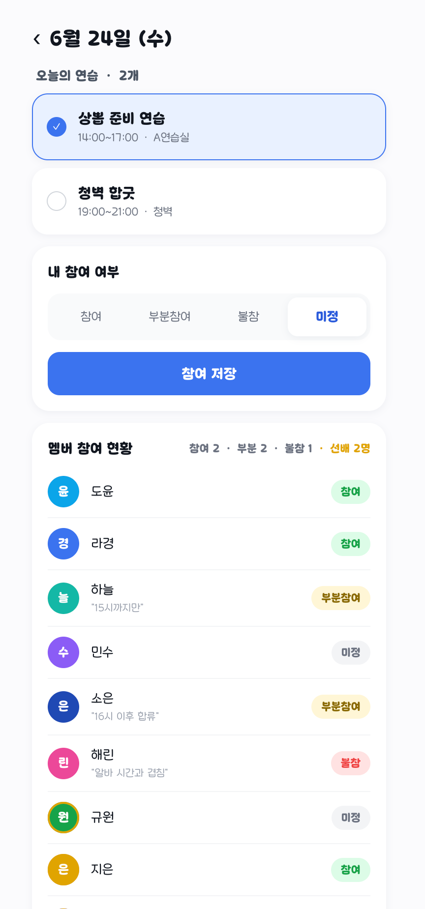
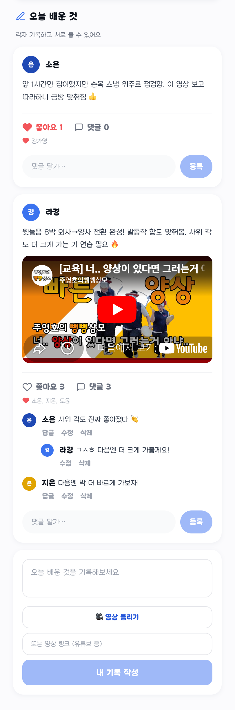
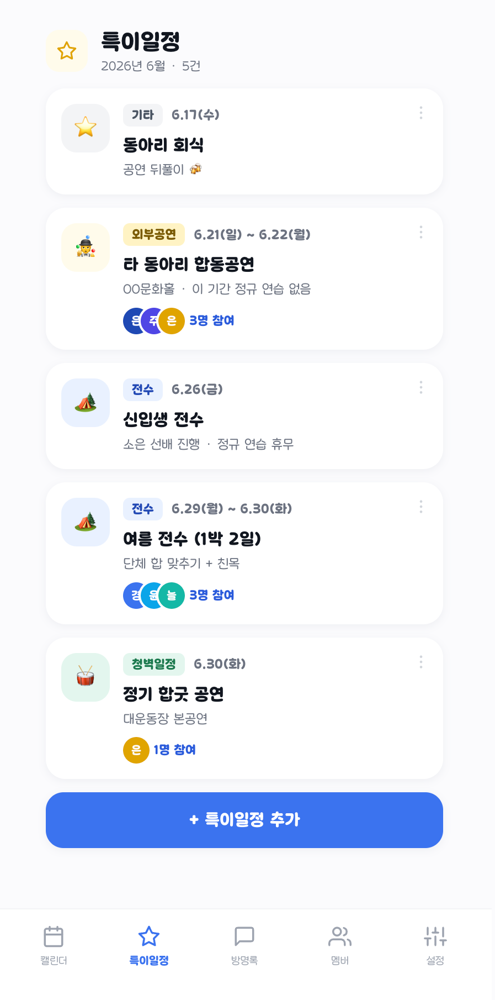
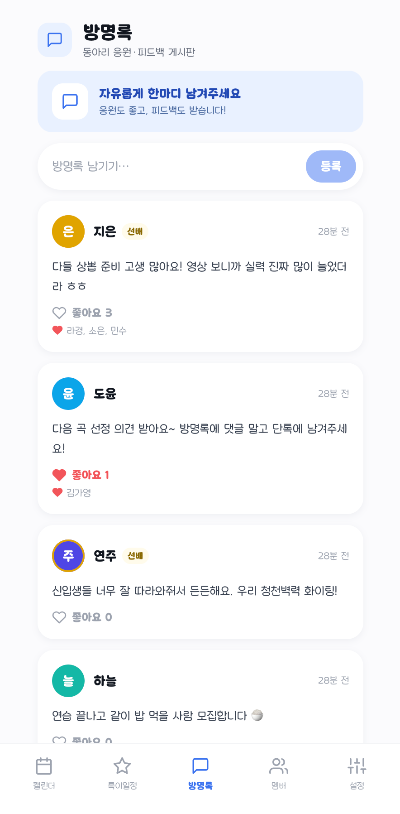
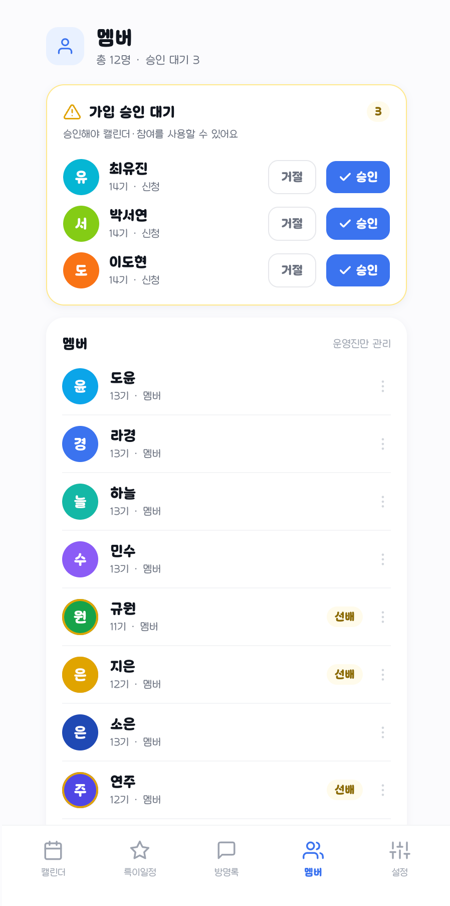
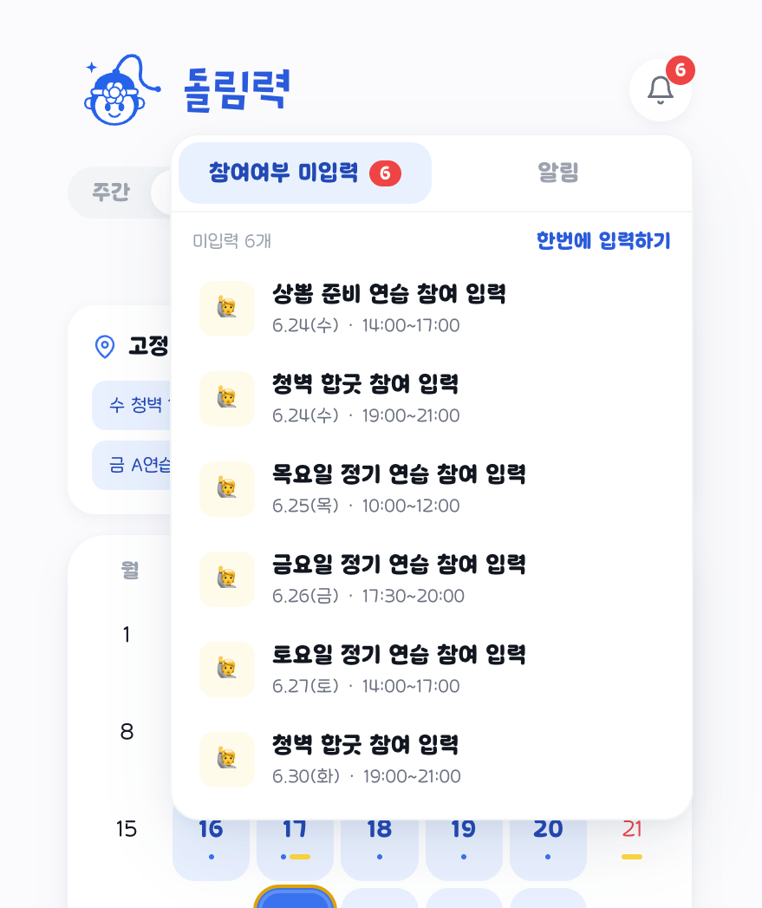

<!-- 초안(draft) — 자유롭게 수정하세요. 커밋 전 검토용입니다.
     화면 캡쳐는 docs/images/ 폴더에 같은 파일명으로 넣으면 바로 보여요. -->

<p align="center">
  
</p>

<p align="center">
  <b>서울여자대학교 중앙풍물패 '청천벽력' 채상의 월간 연습 캘린더</b><br/>
  엑셀로 관리하던 연습 일정·참여여부·기록을 한곳에서.
</p>

<p align="center">
  🔗 <a href="https://dollim-callendar-web.vercel.app">dollim-callendar-web.vercel.app</a>
</p>

---

## 📌 이런 점이 불편했어요

그동안은 **엑셀**로 연습 일정과 참여여부를 관리했어요. 그런데…

- 매달 시트를 새로 복사하고, 참여 칸을 일일이 손으로 채워야 했어요
- 모바일에서 표를 보기 불편하고, 누가 참여하는지 한눈에 안 들어왔어요
- "오늘 배운 것"이나 연습 영상은 단톡·드라이브에 흩어져 사라지기 일쑤였고요
- 선배 참여 여부나 공연·전수 같은 특이일정은 따로 챙기기 번거로웠어요

<!-- 캡쳐(엑셀): PC 엑셀 화면이라 가로로 넓게 — 폭 760 정도(앱 캡쳐보다 크게). -->
<p align="center">
  
  <br/><sub>↑ 기존 엑셀로 관리하던 모습</sub>
</p>

그래서 **우리 동아리 전용 캘린더 앱**을 만들게되었습니다.

---

## ✨ 기능 & 화면

<!--
  📸 캡쳐 가이드
  - 아래 각 항목 위 주석에 "무슨 화면 / 어디를 / 어떻게 자를지" 적어뒀어요.
  - 모바일 화면이라 세로로 길면, 그 기능이 보이는 부분까지만 잘라서 넣으면 돼요.
  - 폭(width): 엑셀(PC 화면)은 가로로 넓으니 760, 앱 캡쳐(모바일)는 한 장 280 / 나란히 260 정도.
  - 파일은 docs/images/ 에 같은 파일명으로 저장.
  - 한 줄에 2장 나란히 넣으려면  두 개를 같은 <p> 안에 두면 돼요(아래 예시 참고).
-->

### 🗓️ 캘린더 — 월간 / 주간
연습·특이일정을 한눈에. 선배가 참여한 날은 금색 테두리로 구분돼요.
요일별 **고정 연습실**을 설정하면 해당 요일에 `정기 연습`이 자동으로 생겨요.

<!-- 캡쳐①: 월간 캘린더 / 캡쳐②: 주간 캘린더 -->
<p align="center">
  
  
</p>

### ✅ 참여 체크
연습마다 **참여·부분참여·불참·미정**을 빠르게 체크해요. 부분참여와 불참은 사유를 남기고, 선배 참여는 따로 집계돼요.

<!-- 캡쳐③: 날짜 클릭 → 하루 상세 페이지의 '내 참여 여부'(4버튼) + 그 아래 '멤버별 참여 현황' 목록 부분까지만. (배운 것 영역은 빼고) -->
<p align="center"></p>

### 📝 오늘 배운 것 — 영상 · 댓글
**오늘 배운 것**을 영상과 함께 남겨요. 유튜브 링크나 직접 업로드한 영상에 좋아요·댓글·답글로 서로 피드백을 주고받아요.

<!-- 캡쳐④: 같은 하루 상세 페이지에서 '오늘 배운 것' 카드 한 개 — 영상(임베드) + 좋아요 + 댓글/답글이 보이는 부분만 잘라서. -->
<p align="center"></p>

### ⭐ 특이일정 &nbsp; 📓 방명록
외부공연·전수·청벽일정·기타 일정을 따로 모아두고, 방명록으로 동아리 피드백을 주고받아요.

<!-- 캡쳐⑤: 특이일정 / 캡쳐⑥: 방명록 -->
<p align="center">
  
  
</p>

### 👥 멤버 관리 &nbsp; 🔔 알림
카카오로 로그인하고 운영진 승인을 받으면 사용할 수 있어요. 첫 가입자는 자동으로 운영진이 돼요.
멤버마다 고른 색으로 캘린더에서 구분되고, 내 글의 댓글·답글이나 참여여부 미입력 연습을 알림으로 모아 봐요. 미입력 연습은 **여러 개를 한번에 입력**할 수 있어요.

<!-- 캡쳐⑦: 멤버 관리 / 캡쳐⑧: 알림 드롭다운 -->
<p align="center">
  
  
</p>

---

## 🧱 기술 스택

| 영역 | 사용 |
|---|---|
| 프레임워크 | Next.js 15 (App Router), React 19 |
| 언어 | TypeScript |
| 데이터 | TanStack Query · 낙관적 업데이트 |
| 백엔드 | Next.js Route Handlers |
| 계약/검증 | zod → zod-to-openapi → **orval**(react-query 훅 자동 생성) |
| DB | Supabase Postgres + **Drizzle ORM** |
| 인증 | Supabase Auth + 카카오 OAuth |
| 저장소 | Supabase Storage (영상 업로드) |
| 스타일 | Tailwind CSS (파랑/노랑 포인트, 둥근 카드 + 그림자) |
| 디자인 | Figma |
| 패키지 | pnpm 모노레포 |

---

## 📁 구조

```
.
├─ apps/
│  └─ web/                         # Next.js 앱 (UI + API)
│     └─ src/
│        ├─ app/
│        │  ├─ (app)/              # 로그인 후 탭 화면 — 공통 레이아웃 + 하단 네비
│        │  │  ├─ calendar/        # 캘린더 (월간 · 주간)
│        │  │  ├─ events/          # 특이일정
│        │  │  ├─ guestbook/       # 방명록
│        │  │  ├─ members/         # 멤버 관리
│        │  │  └─ mypage/          # 마이페이지
│        │  ├─ day/[date]/         # 하루 상세 (참여 체크 · 오늘 배운 것)
│        │  ├─ login/ signup/ pending/ onboarding/   # 가입 · 온보딩 흐름
│        │  ├─ auth/callback/      # 카카오 OAuth 콜백
│        │  ├─ api/                # Route Handlers
│        │  │  ├─ sessions/        #   연습 + 참여(attendance) + 노트
│        │  │  ├─ comments/ notes/ #   댓글 · 좋아요
│        │  │  ├─ events/ guestbook/ members/
│        │  │  ├─ notifications/    #   알림 (댓글 · 참여 미입력)
│        │  │  ├─ fixed-slots/ calendar/   #   고정 연습실 · 선배 참여일
│        │  │  └─ me/ auth/         #   내 정보 · 가입
│        │  └─ opengraph-image.png # 링크 공유 썸네일
│        ├─ components/            # BottomNav, NotificationBell, 아이콘 등 공통 UI
│        └─ lib/                   # supabase 클라이언트 · auth · API 훅(orval) · 유틸
├─ packages/
│  ├─ contracts/                   # zod 도메인 스키마 → OpenAPI 계약
│  │  └─ src/schemas/              # member · session · attendance · note · event · guestbook
│  └─ db/                          # Drizzle ORM
│     └─ src/                      # schema.ts · seed.ts · client.ts
└─ docs/                           # 문서 · README 이미지
```

---

## 🚀 로컬 실행

```bash
pnpm install
pnpm api:gen                       # zod → openapi → orval 타입/훅 생성
pnpm --filter @dollim/web dev      # http://localhost:3000
```
